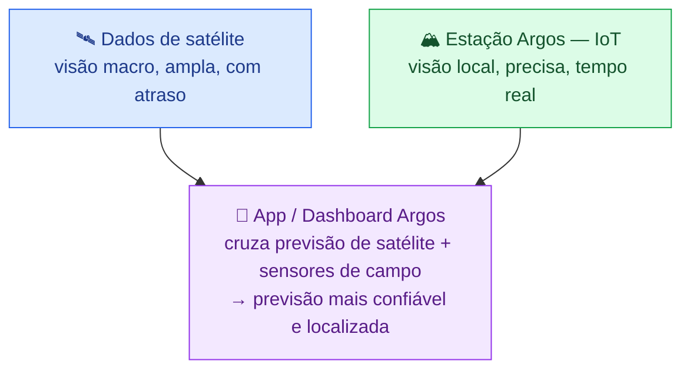
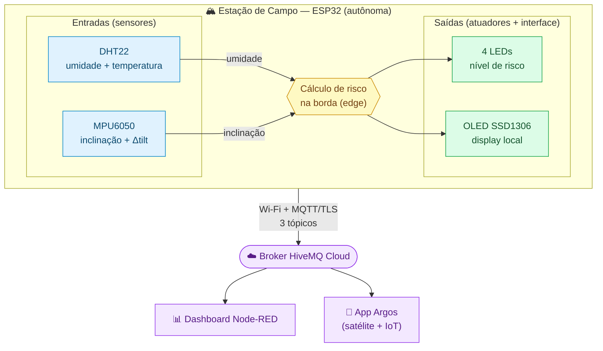

# ARGOS IoT — Estação Argos de Encosta

> **Tema:** Sistemas de previsão climática e prevenção de desastres.
> <br>
> **Disciplina:** *Disruptive Architectures: IoT, IoB & Generative IA*.

## Equipe — Driven Soft

| Nome | RM |
|---|---|
| Felipe Bezerra Beatrici | RM 564723 |
| Max Hayashi Batista | RM 563717 |
| Henrique Cunha Torres | RM 565119 |

### Repositório no GitHub

- https://github.com/Driven-Soft/Argos-IOT

### Vídeo Pitch da Estação Argos:

- [https://youtu.be/jzzeTMLLm0A](http://youtube.com/watch?v=jzzeTMLLm0A)

<hr>

A **Estação Argos de Encosta** é a contraparte **física, de campo** da plataforma
Argos. É um dispositivo autônomo baseado em **ESP32** que se finca numa encosta ou
área de risco e monitora as condições locais **em tempo real**: mede o clima e o
movimento do terreno, **calcula o risco de deslizamento na própria borda (edge)**,
alerta fisicamente com LEDs e publica tudo via **MQTT** para alimentar o app/dashboard.

---

## 1. Contexto: como o ArgosIOT se encaixa no projeto Argos

O **app Argos** é uma plataforma de **previsão climática e prevenção de desastres**
(inundações e deslizamentos). Hoje ele se alimenta de **dados de satélite** —
modelos de chuva, umidade e relevo que cobrem grandes áreas.

Dados de satélite têm uma limitação fundamental: **resolução e atraso**. Eles
enxergam a região "de cima", com células de vários metros/quilômetros e latência de
horas. Eles **não sabem** que *aquela* encosta específica, atrás de *aquelas* casas,
já começou a se mover **agora**.

É aí que entra o **ArgosIOT**. Ele fornece o ***ground truth*** — a verdade do
terreno medida no ponto exato:



**O que o IoT acrescenta à previsão por satélite:**

| Aspecto | Satélite (sozinho) | Com a Estação Argos |
|---|---|---|
| Resolução | Célula de área grande | Ponto exato da encosta |
| Latência | Horas | Segundos (tempo real) |
| Movimento do solo | Não detecta diretamente | Detecta o início do deslizamento |
| Alerta local | Depende de app/celular | LED físico no local, mesmo offline |
| Validação do modelo | — | Confirma/corrige a previsão do satélite |

A narrativa de produto é uma **frota**: a Defesa Civil instala várias estações nas
zonas de risco. Cada uma tem um `ESTACAO_ID` próprio e publica em tópicos MQTT que
carregam esse id, então o app agrega quantas estações forem necessárias — escalar é
apenas adicionar estações.

---

## 2. Arquitetura e fluxo de dados



Operação **totalmente autônoma**: nenhum botão ou intervenção local é necessário.

- **A cada 5 s:** lê sensores → calcula risco → atualiza LEDs e OLED → publica
  `leituras` (e `risco`, se o nível mudou).
- **A cada 30 s:** publica `status` (heartbeat: online, sinal Wi-Fi, uptime).

---

## 3. ENTRADAS (sensores) — inserção de dados

A estação recebe dados **do ambiente físico**, não de comandos. São duas entradas:

### 3.1 DHT22 — fator climático (umidade + temperatura)

| Item | Valor |
|---|---|
| Pino | **GPIO 15** (digital dedicado) |
| Grandezas | Umidade relativa do ar (**%**) e temperatura (**°C**) |
| Taxa de leitura | A cada 5 s (o DHT22 suporta até 0,5 Hz) |
| Biblioteca | `DHT sensor library for ESPx` (DHTesp) |
| Uso no risco | **Umidade** entra como *proxy de saturação climática* |

**Por que umidade?** Ar muito úmido (chuva, neblina persistente) acompanha o
**encharcamento do solo**. Solo saturado perde coesão e fica muito mais propenso a
deslizar. A umidade do ar é uma medida barata e local desse estado climático.
A **temperatura** é lida e exibida no OLED, mas **não entra no cálculo de risco**
(e por isso não é publicada via MQTT).

### 3.2 MPU6050 — gatilho mecânico (inclinação do terreno)

| Item | Valor |
|---|---|
| Pinos | **GPIO 21 (SDA) / GPIO 22 (SCL)** — barramento I²C, endereço `0x68` |
| Grandeza | **Ângulo de inclinação** do terreno (**graus**) |
| Sensor físico | Acelerômetro de 3 eixos (mede o vetor da gravidade) |
| Biblioteca | `Adafruit MPU6050` + `Adafruit Unified Sensor` |
| Uso no risco | Ângulo absoluto **e** variação brusca entre leituras |

**Como o ângulo é obtido.** A inclinação de uma encosta *parada* é medida pela
**direção da gravidade**, captada pelo acelerômetro. Com as componentes `ax, ay, az`:

```
ângulo = atan2( √(ax² + ay²) , |az| )  ·  180/π
```

- Plano/estável → gravidade toda em `az` → **0°**.
- Terreno inclinando → gravidade "vaza" para `ax`/`ay` → ângulo cresce.

> Usamos o **acelerômetro** (gravidade), não o **giroscópio** (velocidade de giro),
> porque queremos o ângulo *estático* da encosta — uma encosta inclinada e parada
> tem giroscópio zero, mas acelerômetro indicando o ângulo.

A cada leitura guardamos o ângulo anterior para calcular a **variação** (`Δtilt`).
Uma variação brusca é o sinal mais direto de um deslizamento **começando agora**.

---

## 4. LÓGICA — cálculo de risco de deslizamento na borda (edge)

Todo o cálculo roda **dentro do ESP32**, sem depender de internet. Isso é o que
permite o **alerta local funcionar mesmo offline** — essencial num desastre, quando
a rede pode cair. O firmware reproduz a **mesma escala semântica** (cores e limiares)
usada no app Argos.

### 4.1 Normalização das entradas (0 a 1)

```text
humNorm  = clamp( (umidade − 40) / 60 , 0, 1 )    // 40% → 0  ...  100% → 1
tiltNorm = clamp(  inclinação / 30   , 0, 1 )     // 30° = encosta em movimento → 1
```

- `humNorm`: abaixo de 40% de umidade o fator climático é desprezível (0); a 100%
  é máximo (1).
- `tiltNorm`: 30° é tratado como "encosta já em movimento" (risco máximo de tilt).

### 4.2 Combinação ponderada

```text
score = humNorm × 0.4  +  tiltNorm × 0.6
```

O **movimento do terreno pesa mais (0.6)** que o clima (0.4): a umidade é uma
*condição que predispõe* ao deslizamento, mas a inclinação é a *evidência direta*
de que ele está acontecendo.

### 4.3 Gatilho mecânico (regra de segurança)

```text
se ( variação_de_inclinação > 5°  entre duas leituras )  →  score = 1.0  (CRÍTICO)
```

Uma mudança abrupta de ângulo sobrepõe qualquer cálculo e força **crítico**
imediatamente — é o solo se movendo *agora*, o evento que mais importa prever.

### 4.4 Classificação em níveis

| Nível | Faixa de score | Cor | Ação física |
|---|---|---|---|
| 🟢 **baixo** | 0.00 – 0.24 | verde (`#22C55E`) | LED verde aceso |
| 🟡 **médio** | 0.25 – 0.49 | amarelo (`#EAB308`) | LED amarelo aceso |
| 🟠 **alto** | 0.50 – 0.74 | laranja (`#F97316`) | LED laranja aceso |
| 🔴 **crítico** | 0.75 – 1.00 | vermelho (`#EF4444`) | LED vermelho **piscando** |

**Exemplo:** umidade 85%, terreno plano (0°):
`humNorm = (85−40)/60 = 0.75`; `tiltNorm = 0`;
`score = 0.75 × 0.4 = 0.30` → nível **médio** (LED amarelo).

### 4.5 Por que isso contribui para a previsão do Argos

- **Fecha a lacuna do satélite:** o satélite prevê *condição climática* na região;
  a estação confirma *no ponto exato* se o solo está reagindo (inclinando).
- **Antecipação real:** a regra de variação brusca captura o **início** do movimento
  — minutos podem significar evacuar a tempo.
- **Redundância de alerta:** mesmo sem rede, o LED vermelho avisa quem está no local.
- **Validação do modelo:** comparar a previsão do satélite com o que a estação
  realmente mede permite **calibrar e melhorar** o modelo de previsão ao longo do tempo.

---

## 5. SAÍDAS (atuadores + interface + telemetria) — resposta do dispositivo

A estação responde em **três camadas**: física (LEDs), local (OLED) e remota (MQTT).

### 5.1 LEDs — alerta físico no local

| LED | Pino | Acende quando |
|---|---|---|
| Verde | GPIO 2 | Risco **baixo** |
| Amarelo | GPIO 4 | Risco **médio** |
| Laranja | GPIO 5 | Risco **alto** |
| Vermelho | GPIO 18 | Risco **crítico** — **pisca** (~1,25 Hz) |

Cada LED usa resistor de 220 Ω. Só o LED do nível atual fica aceso; no crítico, o
vermelho pisca (atualizado a cada loop via `millis()`). É o alerta que funciona
**independente de quem tenha o app** e **mesmo sem internet**.

### 5.2 OLED SSD1306 — interface local

| Item | Valor |
|---|---|
| Pinos | GPIO 21 (SDA) / GPIO 22 (SCL) — I²C, endereço `0x3C` |
| Exibe | Id da estação, **nível de risco** em destaque, umidade, temperatura, inclinação e **status do Wi-Fi (RSSI)** |

Permite a um técnico em campo ler o estado da estação sem nenhum equipamento extra.

### 5.3 Telemetria MQTT — 3 tópicos (alimenta o app/dashboard)

Broker **HiveMQ Cloud** sobre **TLS** (porta 8883). Padrão de tópico:
`argos/estacao/{id}/<sufixo>`. Documentação detalhada em [`docs/mqtt.md`](docs/mqtt.md).

**Tópico 1 — `argos/estacao/{id}/leituras`** *(a cada 5 s)*
```json
{ "id": "sp-mboi-mirim-01", "umidade": 87.4, "inclinacao": 12.7, "ts": "2026-06-04T14:05:00Z" }
```
| Campo | Unidade | Origem |
|---|---|---|
| `umidade` | % | DHT22 |
| `inclinacao` | graus | MPU6050 |
| `ts` | ISO-8601 UTC | relógio NTP da estação |

**Tópico 2 — `argos/estacao/{id}/risco`** *(só quando o nível muda; mensagem retida)*
```json
{ "id": "sp-mboi-mirim-01", "nivel": "critico", "score": 0.82, "ts": "2026-06-04T14:05:00Z" }
```
| Campo | Descrição |
|---|---|
| `nivel` | `baixo` \| `medio` \| `alto` \| `critico` |
| `score` | risco calculado, 0.00–1.00 |

**Tópico 3 — `argos/estacao/{id}/status`** *(a cada 30 s — heartbeat)*
```json
{ "id": "sp-mboi-mirim-01", "online": true, "wifi_rssi": -67, "uptime_s": 3840, "ts": "..." }
```
| Campo | Descrição |
|---|---|
| `online` | estação viva |
| `wifi_rssi` | força do sinal Wi-Fi em dBm (saúde do elo de comunicação) |
| `uptime_s` | segundos desde o boot |

> O tópico `status` é **telemetria de saúde do dispositivo** (a estação está viva e
> consegue se comunicar?), separada da **telemetria de risco** (`leituras`/`risco`).
> Numa frota distribuída, isso permite manutenção preditiva: ver de longe quais
> estações estão com sinal degradando antes de elas caírem.

---

## 6. Mapa de ligação (hardware)

| Componente | Pino ESP32 | Observação |
|---|---|---|
| DHT22 (data) | GPIO 15 | Pino digital dedicado |
| MPU6050 / OLED — SDA | GPIO 21 | Barramento I²C compartilhado |
| MPU6050 / OLED — SCL | GPIO 22 | Barramento I²C compartilhado |
| LED verde | GPIO 2 | Resistor 220 Ω |
| LED amarelo | GPIO 4 | Resistor 220 Ω |
| LED laranja | GPIO 5 | Resistor 220 Ω |
| LED vermelho | GPIO 18 | Resistor 220 Ω |

MPU6050 (`0x68`) e OLED SSD1306 (`0x3C`) coexistem no mesmo I²C por terem endereços
diferentes; o DHT22 usa um pino digital separado. Circuito completo em
[`diagram.json`](diagram.json) (Wokwi, placa `board-esp32-devkit-c-v4`).

---

## 7. Build & simulação

Projeto **PlatformIO** (ESP32 / framework Arduino).

```bash
pio run            # compilar
# Simular no Wokwi (extensão "Wokwi for VS Code"):
#  1. compile com `pio run`
#  2. abra diagram.json e clique em "Start Simulation"
```

**Bibliotecas** (resolvidas via `platformio.ini`): `PubSubClient`, `ArduinoJson`,
`DHT sensor library for ESPx`, `Adafruit MPU6050` + `Adafruit Unified Sensor`,
`Adafruit SSD1306` + `Adafruit GFX`.

**Conectividade:** Wi-Fi `Wokwi-GUEST` (sem senha); MQTT HiveMQ Cloud via TLS.

**Testar os níveis na simulação:**
- *Médio* (padrão): umidade 85% no DHT22.
- *Alto/Crítico*: clique no MPU6050 e aumente a **aceleração** em `ax`/`ay` para
  elevar o ângulo (>30° = crítico); uma variação >5° entre leituras também força crítico.
- Ajuste a umidade clicando no DHT22 durante a simulação.

---

## 8. Dashboard (Node-RED)

O fluxo pronto está em [`flows/flows.json`](flows/flows.json). No Node-RED:
*menu (☰) → Import → cole o conteúdo de `flows/flows.json` → Deploy*.

Depois do import, abra o nó **HiveMQ Cloud (Argos)** e preencha **usuário e senha**
(as credenciais não são exportadas no JSON). O dashboard fica em `/ui`:

- **Leituras:** gauges + gráficos de umidade (%) e inclinação (°);
- **Risco:** nível colorido (🟢🟡🟠🔴), gauge de score e *toast* de alerta no crítico;
- **Status:** online/offline, sinal Wi-Fi (RSSI) e uptime.

> Requer o módulo `node-red-dashboard`. Os tópicos usam curinga
> (`argos/estacao/+/...`), então o fluxo serve qualquer estação da frota.

Para implantar outra estação da frota, basta trocar a constante `ESTACAO_ID` no topo
de [`src/main.cpp`](src/main.cpp).

---

## 9. Estrutura do repositório

```
ArgosIOT/
├── README.md              # este arquivo
├── platformio.ini         # build + dependências
├── diagram.json           # circuito Wokwi
├── wokwi.toml             # config do simulador
├── flows/flows.json       # dashboard Node-RED (importar e dar Deploy)
├── src/main.cpp           # firmware do ESP32
└── docs/mqtt.md           # documentação dos 3 tópicos MQTT
```

---

> ### 🛰️ _Onde o satélite enxerga a tempestade, a Estação Argos sente o chão se mover._
>
> **Argos IoT — Driven Soft** · da nuvem ao chão, transformando previsão em prevenção.
